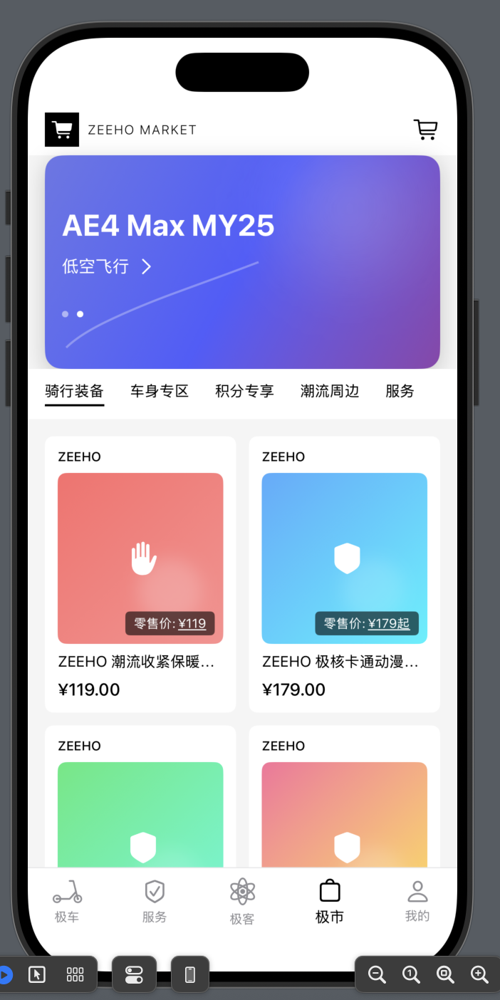
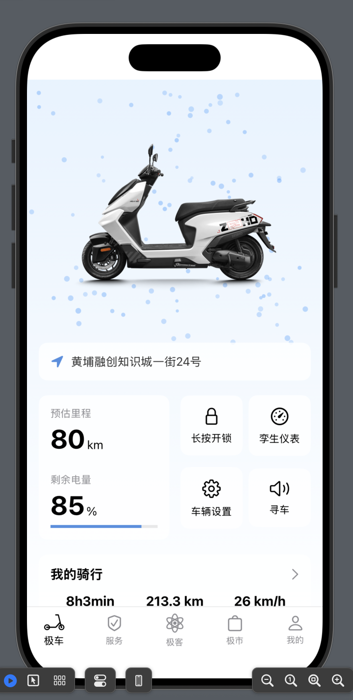

# 智能电动车 iOS 应用

这是一个基于 SwiftUI 开发的智能电动车管理应用，为用户提供全方位的车辆监控和管理功能。

<<<<<<< HEAD
## 演示






## 功能特点

### 🏠 首页
- 实时车辆状态展示
- 动态粒子背景效果
- 电量和里程实时监控
- 车辆定位信息显示
- 快捷功能（开锁、寻车等）
- 骑行数据统计

### 🔧 服务
- 车辆维修服务
- 服务指南
- 服务网点查询

### 🎮 极客模式
- 车辆高级设置
- 性能参数调节
- 系统诊断

### 🛒 商城
- 配件购买
- 周边商品
- 优惠活动

### 👤 个人中心
- 用户信息管理
- 骑行历史记录
- 积分规则
- 设置

## 技术栈

- SwiftUI
- iOS 14.0+
- Swift 5.0+

## 项目结构

```
cheTest202507/
├── Assets.xcassets/      # 资源文件
├── Constants/            # 常量定义
├── Extensions/           # Swift 扩展
├── Shared/              # 共享组件
│   └── Views/           # 可复用视图组件
└── Views/               # 主要视图
    ├── MainView         # 主视图
    ├── HomeView         # 首页
    ├── ServiceView      # 服务页面
    ├── GeekView         # 极客模式
    ├── MarketView       # 商城
    └── ProfileView      # 个人中心
```

## 特色功能

1. **实时监控**
   - 电量状态
   - 预估里程
   - GPS 定位

2. **智能交互**
   - 一键开锁
   - 寻车功能
   - 孪生仪表

3. **数据统计**
   - 骑行时长
   - 行驶距离
   - 平均速度

4. **个性化设置**
   - 车辆参数调节
   - 用户偏好设置
   - 系统主题定制

## 开发环境要求

- Xcode 13.0+
- iOS 14.0+
- macOS Catalina (10.15.4) 或更高版本

## 安装说明

1. 克隆项目到本地：
```bash
git clone [项目地址]
```

2. 打开项目：
```bash
cd cheTest202507
open cheTest202507.xcodeproj
```

3. 在 Xcode 中运行项目

## 贡献指南

欢迎提交 Issue 和 Pull Request 来帮助改进项目。在提交 PR 之前，请确保：

1. 代码符合项目的编码规范
2. 新功能有完整的测试覆盖
3. 所有测试都能通过
4. 更新相关文档

## 许可证

[许可证类型] - 查看 LICENSE 文件了解详情

## 联系方式

如有问题或建议，请通过以下方式联系我们：

- 提交 Issue
- 发送邮件至 [730170034@qq.com] 
=======
## 版本记录

### v1.0.0 (2024-01-09)
- ✨ 首次发布
- 🎨 完整的 UI 界面设计
- 🏠 首页功能实现
  - 实时车辆状态展示
  - 动态粒子背景效果
  - 电量和里程监控
  - 车辆定位展示
  - 快捷功能按钮
  - 骑行数据统计
- 🔧 服务模块基础功能
- 🎮 极客模式界面
- 🛒 商城模块界面
- 👤 个人中心基础功能

## 演示 
>>>>>>> 916e5e882d7d848293199e4bba5b985403fe9a0f
